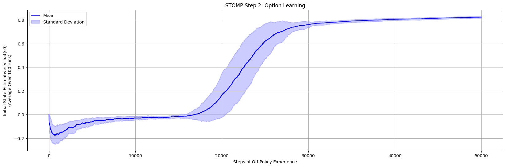

# Subtask, Option, Model, Planing - STOMP

## Introduction

This is an implementation of the STOMP framework, described by (SUTTON et al., 2023) ^[1], which is used in the model-based reinforcement learning to learn options, create environment models based on the learned options and then execute planning with the learned options models.

An important disclaimer is that this this implementation only tried to reproduce the results for the two-rooms environment and didn't reach the exact results described on the paper.

It is important to notice that this is still a work in progress but contributions are welcome.

## Results

The full results can be seen in the main.ipynb notebook, but here are a summary of the achieved results

### STOPM Step 2: Option Learning

For the Option Learning plots we achieved a close results as compared to the one on the paper, and the intra-policy that we learn, it is very similar to the one on the paper too.

However, here are two main difference that we can spot in the two images are:

1. In the sutton paper, the start state estimative seems to reach a minimum value of -1.3, while in our implementation our minimum value is -0.2;
2. In the sutton paper, the start state estimative decline more aggressively and the have a "v" shape, while our curve have a less aggressive decline and have something more like a "s" shape.

Nevertheless those differences, we believe that our implementation of Option Learning is correct and reflects the paper description, while the differences pointed here can be attribute to  image scale errors.

| Our Implementation | Original Paper Results |
|:-----------------:|:---------------------:|
|  |  |

### STOPM Step 3: Model Learning

We did implemented the model learning but we didn't plot the RMS error of such models for lack of clarity on how those errors were calculated.

### STOPM Step 4: Option Learning

For the planning with options case we have a more severe difference. In our experiments we were not able to make converge the curve to the value optimal value. Also, in several experiments the estimative explode and reached values in the magnitude of 10e6.

Important considerations about our planning code:

1. In the paper it is mentioned that the vector **w** of the environment is randomly initialized and also is said that is zero initialized. In our implementation we consider the zero initialization
2. The paper mentioned that 5 models were learned, one for the real option and other 4 for the primitive action, but the paper didn't explicitly tells how the primitive actions models are learned and we considered 5 linear models.

| Our Implementation | Original Paper Results |
|:-----------------:|:---------------------:|
|  |  |

## Reference

[1] Sutton, R. S., Machado, M. C., Holland, G. Z., Szepesvari, D., Timbers, F., Tanner, B., & White, A. (2023). Reward-respecting subtasks for model-based reinforcement learning. Artificial Intelligence, 324. https://doi.org/10.1016/j.artint.2023.104001