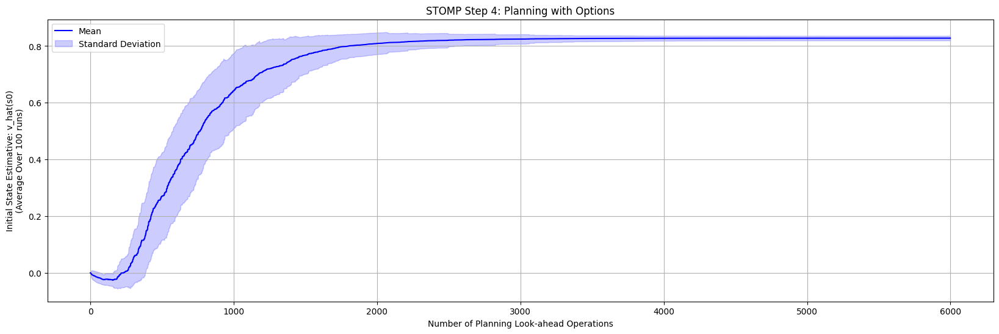

# SubTask, Option, Model, Planning - STOMP

## Installation

```bash
$ pip install -e .
```

## Introduction

This is an implementation of the STOMP framework, described by (SUTTON et al., 2023) ^[1], which is used in the model-based reinforcement learning to learn options, create environment models based on the learned options and then execute planning with the learned options models.

An important disclaimer is that this this implementation only tried to reproduce the results for the two-rooms environment and didn't reach the exact results described on the paper.

It is important to notice that this is still a work in progress and contributions are welcome.

## Results

The full results can be seen in the `main.ipynb` notebook and `./experiments_from_stomp` folder, and to run the code using a multithread approach, please refer to `main.py`. Here are a summary of the achieved results:


### STOMP Step 2: Option Learning

In the Option Learning step, we are learning the value function and the policy of an option policy that reaches the hallway in TwoRooms domain. Our plots achieved a close result as compared to the one in the paper, and the intra-policy we learned is very similar to the one in the paper too.

However, we spotted two main differences between our results and the originals from the paper:

1. Our value estimatives of the initial state (blue line, right axis) reach a minimum of ~-0.2, while the estimatives in the paper reach a bottom of ~-1.3; Also, we notice the value estimatives in the paper decline more aggressively and form a _V_ shape, in contrast to our results that decline more smoothly and form a _S_ shape.
2. The RMSE was computed over all optimal state value and the predictions of our learned parameters (red line, left axis). In our implementation, the curve tops at around ~1.1 whereas the original implementation the error reaches over ~1.6.

Nevertheless those differences, we believe that our implementation of Option Learning is correct and reflects the paper description. We notice that after 50000 steps both curves ends in a similar value.

| Our Implementation | Original Paper Results |
|:-----------------:|:---------------------:|
|  |  |


### STOMP Step 3: Model Learning

For Model Learning, we learn the model of the hallway option and we are evaluating the shape and numerical results of the blue and red line. The blue line (right axis) is the error in the transition model. The red line (left axis) is the error in the reward model.

We achieved very similar results but we noted this slight difference:

1. The RMSE of the reward model (red line) was computed over all states. The results we obtained form a similar curve shape to the original, but our initial error starts at around ~0.5 and reaches a minimum of around ~0.2. The same curve in the original work starts at ~0.3 and ends below ~0.1.

We assume the learned model is correct due to the shape of the curve and the difference in values might be a detail in implementation or scale of the graph.

| Our Implementation | Original Paper Results |
|:-----------------:|:---------------------:|
|  |  |


### STOMP Step 4: Planning

For Planning, our plot does not start at zero, but it is reaching the optimal value and have the same shape of the one presented by the authors. It is not entirely clear of what is been plotted on the paper and although the standard deviation of our plot seems huge, it is only a difference of ~0.015.

Therefore, we consider our implementation of the paper is correct.

| Our Implementation | Original Paper Results |
|:-----------------:|:---------------------:|
|  |  |

## Reference

[1] Sutton, R. S., Machado, M. C., Holland, G. Z., Szepesvari, D., Timbers, F., Tanner, B., & White, A. (2023). Reward-respecting subtasks for model-based reinforcement learning. Artificial Intelligence, 324. https://doi.org/10.1016/j.artint.2023.104001
